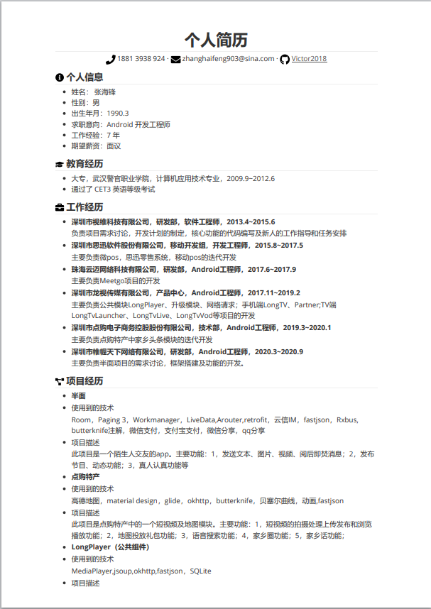
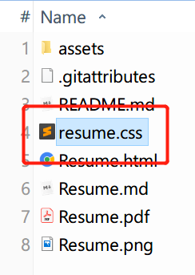
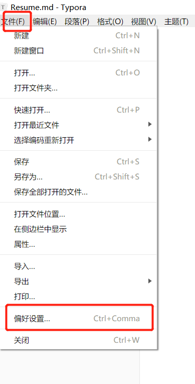
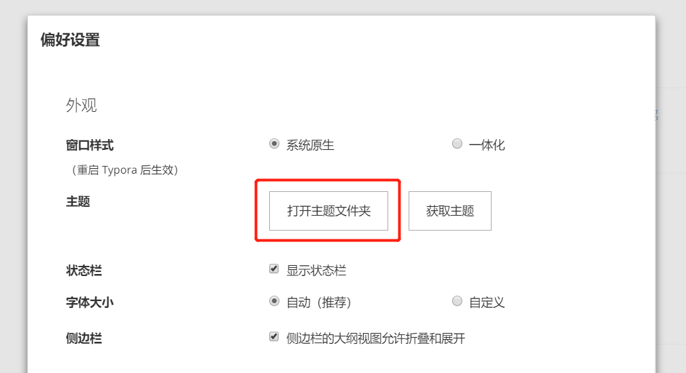
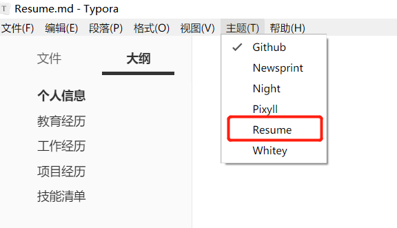
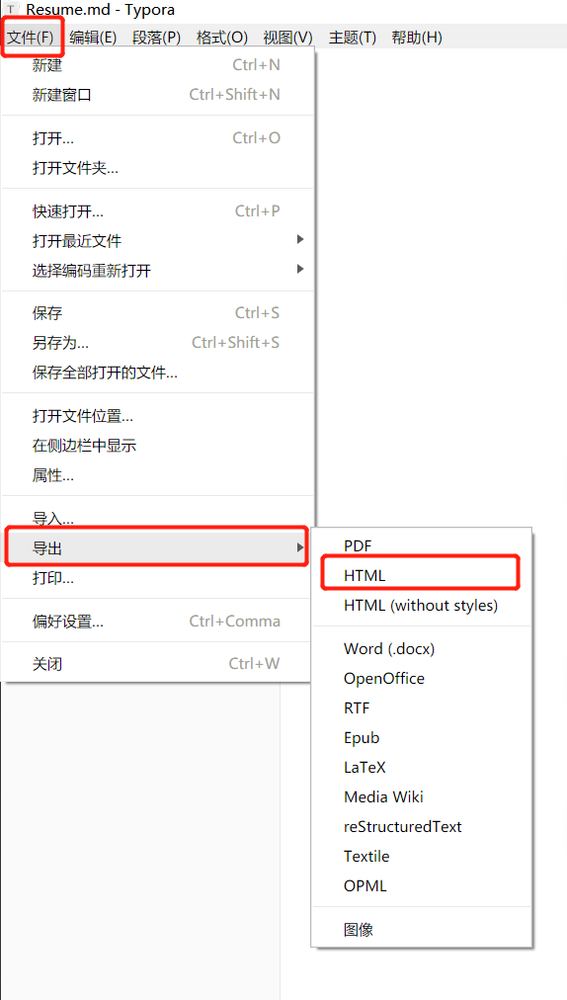
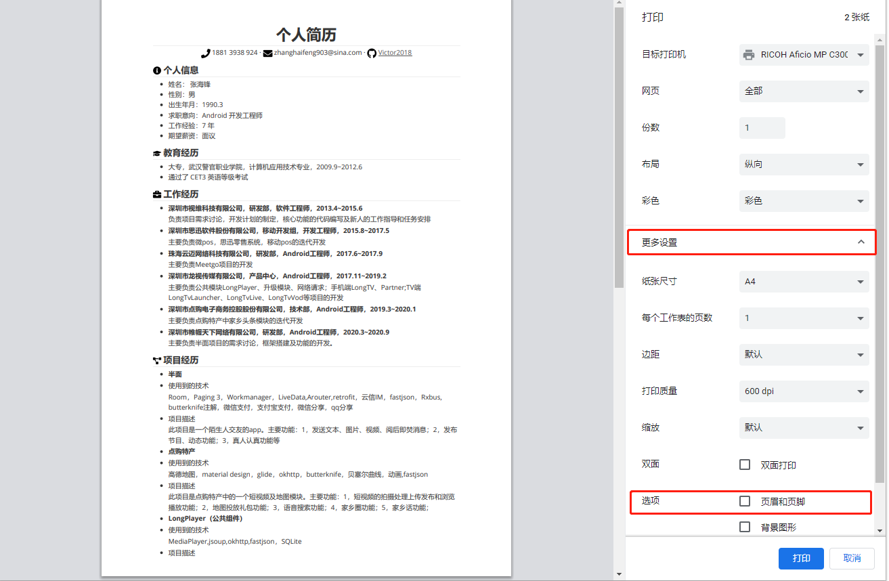

# VictorResume
 

## 如何使用

把该项目 Clone 之后，修改 [RESUME.md](RESUME.md) 文件即可。

## 导出 PDF

推荐使用 Typora 编辑器，先导出成 HTML，之后再使用浏览器打印成 PDF。

因为 Markdown 格式不够紧凑，需要修改一些样式，否则会让原本只要一页的内容变成两三页。

（1）将 resume.css 复制到 Typora 的主题文件夹

（2）主题文件夹可以在“文件->偏好设置->主题文件夹“中打开

（3）之后重启一下 Typora 编辑器，并在主题中选择 Resume。

（4）使用以下方式导出成 HTML：文件 -> 导出 -> HTML

（5）使用浏览器打开导出的 HTML 文件，并按“ctrl+P”打印，需要去除页眉页脚。

# 关注开发者：
- 邮箱： victor423099@gmail.com
- 新浪微博
- 

## License

Copyright (c) 2017 Victor

Licensed under the Apache License, Version 2.0 (the "License");
you may not use this file except in compliance with the License.
You may obtain a copy of the License at

    http://www.apache.org/licenses/LICENSE-2.0

Unless required by applicable law or agreed to in writing, software
distributed under the License is distributed on an "AS IS" BASIS,
WITHOUT WARRANTIES OR CONDITIONS OF ANY KIND, either express or implied.
See the License for the specific language governing permissions and
limitations under the License.

